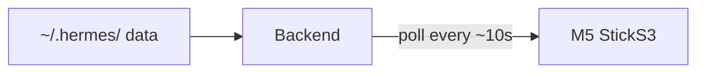

# HermesLens — Design Document

## Project Overview

HermesLens is an open-source physical dashboard for Hermes Agent that runs on an M5 StickS3 device. It provides a real-time, glanceable view of your agent team, tasks, system health, and usage stats.

---

## Design Decisions

### Q1: Data Discovery
- **Default**: Auto-detect Hermes home at `~/.hermes/` or `$HERMES_HOME` env var
- **Override**: Optional `hermes_home` setting in `~/.hermeslens.yaml` for non-standard paths
- **Never writes** to Hermes data — read-only data collection

### Q2: Agent Discovery
- **Default**: Auto-discover all profiles from `~/.hermes/profiles/`
- **Override**: Config filter to show only specific agents (`agents: [timmy, cooper]`)
- **Fallback**: If no profiles found, show single "Default" agent

### Q3: Auth Model
- **Default**: Bind to `127.0.0.1` only (localhost, no auth needed)
- **Config option**: `host: 0.0.0.0` for LAN access
- **Config option**: `api_key: <secret>` for optional token-based auth
- Pattern matches Hermes dashboard's approach

### Q4: Data Flow
- **Poll model**: M5 fetches `/api/status` every N seconds (default ~10s)
- Configurable refresh interval in `~/.hermeslens.yaml`
- Simple, resilient, easy to debug

### Q5: UI Layout (4 Pages + Navigation)

| # | Page | Content |
|---|------|---------|
| 1 | **Agents** | Agent team cards: name, role, status dot, progress bar, current task |
| 2 | **Tasks** | Kanban summary: counts by status (ready/active/blocked/done), recent task updates |
| 3 | **System** | Gateway state, connected platforms (Discord/Telegram/etc), active sessions, cron jobs |
| 4 | **Usage** | Active model, session count, message/tool call counts, token usage, estimated cost |

**Navigation:**
- **Touch left swipe** → Previous page
- **Touch right swipe** → Next page
- **Touch tap on agent** → Show agent detail overlay
- **Front button (short)** → Next page
- **Front button (long)** → Detail overlay for current item
- **Side button (short)** → Previous page
- **Side button (long)** → Jump to Agents page (home)

**Configurable pages order** — users can reorder or disable in config.
**No auto-cycle** by default (configurable option added later).

### Q6: Config Format
- **YAML** at `~/.hermeslens.yaml`
- Comments supported
- One file, simple, discoverable

### Q7: Installation Method
- **Primary**: `pip install hermeslens` standalone package
  - Run with `hermeslens` or `python -m hermeslens`
- **M5 firmware** as subfolder within the same repository
- **Future option**: Hermes plugin integration

---

## API Endpoints

The HermesLens backend exposes a FastAPI server:

| Endpoint | Description |
|----------|-------------|
| `GET /api/status` | Full dashboard data (all pages in one call) |
| `GET /api/health` | Backend liveness check |

### `/api/status` Response Shape

```json
{
  "version": "0.1.0",
  "hermes_version": "0.13.0",
  "hermes_home": "/home/user/.hermes",
  "gateway": {
    "state": "running",
    "platforms": {
      "discord": "connected",
      "telegram": "disconnected"
    },
    "active_agents": 2
  },
  "agents": [
    {
      "name": "timmy",
      "role": "Ghost CMS",
      "status": "active",
      "current_task": "Deploying theme fix",
      "task_progress": 42,
      "last_active": "2026-05-14T15:30:00Z",
      "model": "stepfun/step-3.5-flash"
    }
  ],
  "tasks": {
    "ready": 3,
    "in_progress": 2,
    "blocked": 1,
    "done": 12,
    "recent": [
      {"title": "Install theme", "status": "done", "assignee": "timmy"},
      {"title": "Photo pipeline", "status": "in_progress", "assignee": "cooper"}
    ]
  },
  "system": {
    "gateway_state": "running",
    "platforms_connected": ["discord"],
    "active_sessions": 3,
    "cron_jobs": [
      {"name": "Blog check", "schedule": "every 2h", "next_run": "16:00"}
    ]
  },
  "usage": {
    "model": "stepfun/step-3.5-flash",
    "sessions_total": 247,
    "messages_total": 3891,
    "tool_calls_total": 843,
    "tokens_input": 1200000,
    "tokens_output": 456000,
    "estimated_cost_usd": 0.87,
    "sessions_today": 12
  }
}
```

---

## Project Structure


**Hermes home** is read-only.
**M5** reads `/api/status`, renders the dashboard.

---

## Data Sources

| Source | Path | Access Method | Data |
|--------|------|---------------|------|
| Gateway state | `~/.hermes/gateway_state.json` | JSON read | Running state, platforms, active_agents count |
| Sessions | `~/.hermes/state.db` | SQLite query | Sessions, messages, token counts, timestamps (only recent data — last 100 sessions) |
| Kanban tasks | `~/.hermes/kanban.db` (tasks table) | SQLite query | Task title, assignee, status, priority |
| Kanban runs | `~/.hermes/kanban.db` (task_runs table) | SQLite query | Run history, success/failure outcomes |
| Cron jobs | `~/.hermes/cron/` | Directory scan + JSON parse | Job schedules, scripts, status |
| Profiles | `~/.hermes/profiles/` | Directory listing | Agent names and role inference from configs |

---

## Phases

### Phase 0: Design ✅
- [x] Project named: HermesLens
- [x] Architecture: backend + C++ firmware on M5 StickS3
- [x] API schema and data sources defined

### Phase 1: Backend ✅
- [x] FastAPI server with `/api/status` and `/api/health`
- [x] Config loader (YAML)
- [x] Data collectors: gateway, sessions, kanban, profiles, cron
- [x] Graceful defaults when Hermes data is missing

### Phase 2: Firmware ✅
- [x] C++ / PlatformIO rewrite
- [x] WiFi STA + AP captive portal
- [x] NVS config persistence
- [x] 4-page dashboard (Agents, Tasks, System, Usage)
- [x] Touch + physical button navigation

### Phase 3: Polish 🔜 Next
- [ ] Backend schema verified against live Hermes data
- [ ] End-to-end hardware test
- [ ] Error screens + loading states
- [ ] Final docs cleanup

### Phase 4: Release ⏳
- [ ] GitHub repo
- [ ] Community flash package
- [ ] Demo media
